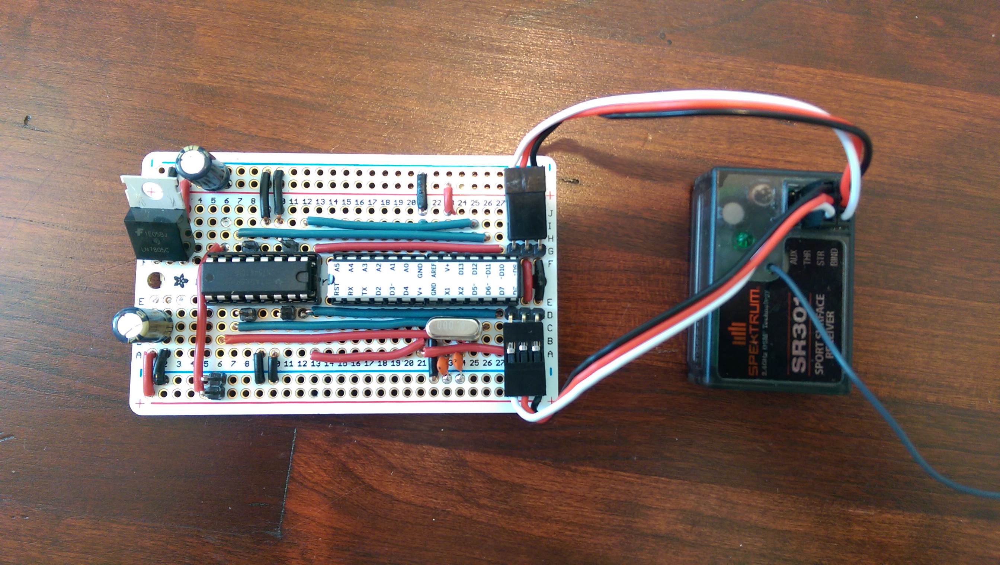

Description
-------------------
This ATmega328p + [SN754410 H-Bridge](https://www.sparkfun.com/products/315) based project was meant to fix my son's R/C truck that I dropped and cracked the control board.

It also upgrades the controller to my Spektrum DX3C for improved range, and also enables an external battery pack, like a small 7.4v 2 cell 180 mAh LiPo from a Losi Micro Crawler.

Overall, it works pretty well in my early tests though sometimes it isn't as responsive to steering input, I believe when the motors are both under heavy load. I am also not sure if it has proper flyback diode protection, but so far it doesn't seem to matter. The H-Bridge also gets hot, but not excessivly so.

Eventually, I may upgrade it to use a cheap BLE module but for now I am calling this done.

Final Proto-Board
------------------

